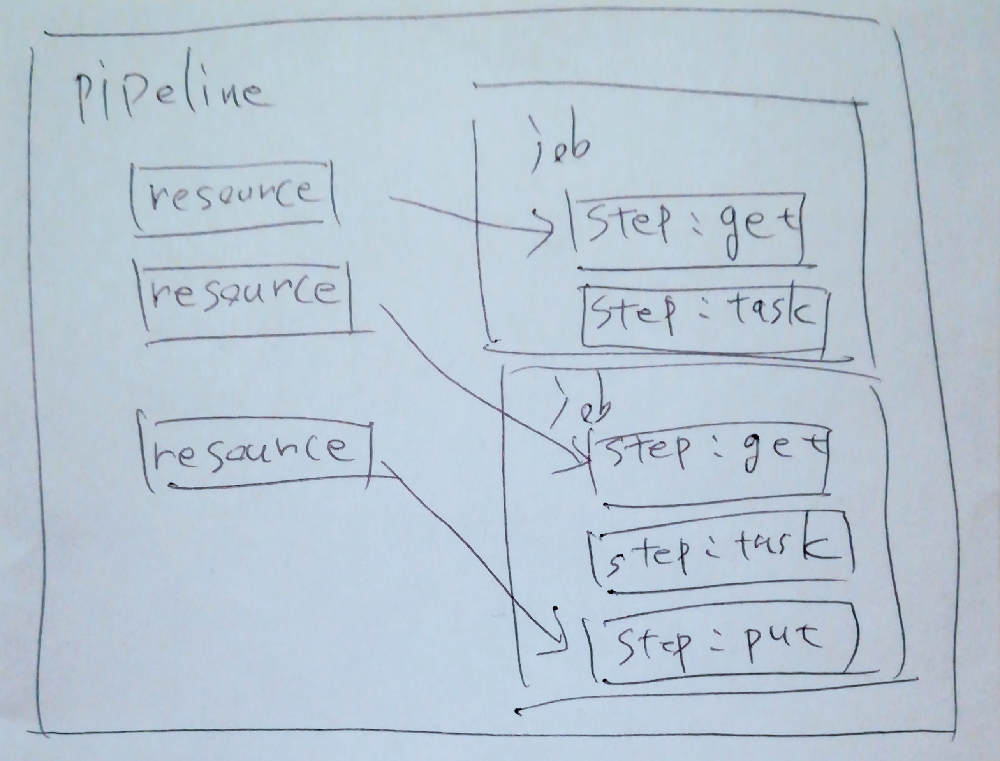

class: center, middle

# Concourse CI入門<br>ライブ環境構築＆ビルド

---

## 自己紹介

- うらがみ
- `@backpaper0` / `urgm.jp`
- 大阪 / 11年ちょい / Java

---

## 今回話す/行うこと

- Concourseの概要
  - アーキテクチャ
  - 環境構築
  - ビルドパイプライン
- デモ
  - Docker ComposeでConcourseを起動
  - ビルドパイプラインの登録 / 実行

---

## 今回話さないこと

- CI/CD論
- 事例
- Jenkins、Travis、CircleCIなどとの比較

---

class: center, middle

# Concourseの概要

---

class: center, middle

# アーキテクチャ

---

## アーキテクチャ

- Web
  - ATC（Web UI、スケジューラー）
  - TSA（SSHサーバー）
- Worker
  - Garden（コンテナ管理）
  - Baggageclaim（ボリューム管理）
- DB（PostgreSQL）

---

## アーキテクチャ

- [コンセプトページ](https://concourse-ci.org/concepts.html)
  - [アーキテクチャ図](https://concourse-ci.org/images/concourse_architecture.png)

---

## アーキテクチャ

Web

- Web UI or `fly`コマンドでジョブのスケジューリング
- 前にLBを置いてスケールできる
- UIはElmで作られたSPA
- UI以外はGo
- DBへパイプラインの設定やビルドログなど全て登録
- バックアップはDBのデータだけで良さげ

---

## アーキテクチャ

Worker

- コンテナとボリュームの管理
- SSHでWebへ登録
- スケールアウトできる（ノード毎にWebへ登録）
- Webからの指示でコンテナ立ててビルド実施
- DBは見ない

---

## 脱線：Elm

- ConcourseのWeb UIはElmで作られている
- altJSのひとつ
- シンプルなコードでSPAが書ける
- model / view / update
- http://elm-lang.org/

---

## 脱線：Elm

model

```elm
type alias Model = { message: String,
                     newMessage: String }

model : Model
model = { message = "Hello, world!", newMessage = "" }
```

---

## 脱線：Elm

view

```elm
view : Model -> Html Msg
view model =
  div [style [("margin", "2rem")]]
    [ div [] [text model.message],
    div [] [
      input [ type_ "text", value model.newMessage,
              onInput Input, autofocus True ] [],
      button [ onClick Submit ] [text "Click me"] 
    ]]
```

---

## 脱線：Elm

update

```elm
type Msg = Submit | Input String

update : Msg -> Model -> Model
update msg model =
  case msg of
    Input newMessage ->
        { model | newMessage = newMessage }
    Submit ->
        { message = model.newMessage, newMessage = "" }
```

---

## 脱線：Elm

```elm
main : Program Never Model Msg
main =
  Html.beginnerProgram {
    model = model, 
    view = view,
    update = update
  }
```

---

## アーキテクチャ（再掲）

- Web
  - ATC（Web UI、スケジューラー）
  - TSA（SSHサーバー）
- Worker
  - Garden（コンテナ管理）
  - Baggageclaim（ボリューム管理）
- DB（PostgreSQL）

---

class: center, middle

# 環境構築

---

## 構築方法

`web`と`worker`が`concourse`という1つのバイナリで提供されている

- `concourse quickstart` ※別途PostgreSQLが必要
- Docker Compose
- BOSH（ https://bosh.io/ ）

今日はDocker Composeを使った構築方法を紹介

---

## 手順

- Docker Composeをインストールする
- 鍵を準備する
- `docker-compose.yml`で次の3つのサービスを定義する
  - PostgreSQL
  - web
  - worker
- `docker-compose up -d`

https://github.com/concourse/concourse-docker

---

## docker-compose.ymlの例

PostgreSQL

```yaml
concourse-db:
  image: postgres
  volumes: ["database:/database"]
  environment:
  - POSTGRES_DB=concourse
  - POSTGRES_PASSWORD=concourse_pass
  - POSTGRES_USER=concourse_user
  - PGDATA=/database
```

---

## docker-compose.ymlの例

web

```yaml
concourse-web:
  image: concourse/concourse
  command: web
  links: [concourse-db]
  depends_on: [concourse-db]
  ports: ["8080:8080"]
  volumes: ["./keys/web:/concourse-keys"]
```

---

## docker-compose.ymlの例

web

```yaml
  environment:
  - CONCOURSE_POSTGRES_HOST=concourse-db
  - CONCOURSE_POSTGRES_USER=concourse_user
  - CONCOURSE_POSTGRES_PASSWORD=concourse_pass
  - CONCOURSE_POSTGRES_DATABASE=concourse
  - CONCOURSE_EXTERNAL_URL
  - CONCOURSE_BASIC_AUTH_USERNAME=concourse
  - CONCOURSE_BASIC_AUTH_PASSWORD=concourse
  - CONCOURSE_NO_REALLY_I_DONT_WANT_ANY_AUTH
```

---

## docker-compose.ymlの例

worker

```yaml
concourse-worker:
  image: concourse/concourse
  command: worker
  privileged: true
  links: [concourse-web]
  depends_on: [concourse-web]
  volumes: ["./keys/worker:/concourse-keys"]
  environment:
  - CONCOURSE_TSA_HOST=concourse-web:2222
  - CONCOURSE_GARDEN_NETWORK
```

---

## 認証方法いろいろ

- Generic OAuth Authentication
- Github Authentication
- GitLab Authentication
- No Authentication
- UAA Authentication
- Basic Authentication
- Bitbucket Cloud Authentication
- Bitbucket Server Authentication

---

## 認証方法いろいろ

Basic Authentication（Web UIはログインフォーム）

```yaml
  environment:
  - CONCOURSE_BASIC_AUTH_USERNAME=concourse
  - CONCOURSE_BASIC_AUTH_PASSWORD=concourse
```

---

## 認証方法いろいろ

Github Authentication

```yaml
  environment:
  - CONCOURSE_EXTERNAL_URL=http://example.com:8080
  - CONCOURSE_GITHUB_AUTH_CLIENT_ID=00000000000000000000
  - CONCOURSE_GITHUB_AUTH_CLIENT_SECRET=0000000000000000000000000000000000000000
  - CONCOURSE_GITHUB_AUTH_USER=backpaper0
# - CONCOURSE_GITHUB_AUTH_TEAM=myorg/myteam
# - CONCOURSE_GITHUB_AUTH_ORGANIZATION=myorg
```

---

class: center, middle

# ビルドパイプライン

---

## 概念

- pipeline
- resource
- job
- step
- task

pipelineは複数のresourceとjobを持つ

jobは複数のstepを持つ

taskはstepの中のひとつ

---

## 概念

.image2[

]

---

## resource

公式

- `git` / `hg` / `time` / `s3` / `archive` / `semver` / `github-release` / `docker-image` / `tracker` / `pool` / `cf` / `bosh-io-release` / `bosh-io-stemcell`

コミュニティ

- `Slack notifications` / `GitHub Pull Request` / `Twitter` / `Google Drive` / `Kubernates` / `Maven Resource` など……

---

## step

step

- `get` / `put` / `task` / `aggregate` / `do`

hook

- `on_success` / `on_failure` / `on_abort` / `ensure`

modifier

- `tags` / `timeout` / `attempts`

---

## パイプラインの定義

- YAMLで定義する
- `fly set-pipeline`コマンドで登録する

```sh
# sp は set-pipeline のエイリアス
# -p でパイプライン名を設定
# -c でパイプラインの定義ファイルを指定
fly -t main sp -p my-pipeline -c my-pipeline.yml
```

---

## パイプラインの定義

```yaml
resources:
- name: source
  type: git
  source:
    uri: https://github.com/backpaper0/collectors.git
- name: timer
  type: time
  source:
    interval: 1m
```

---

## パイプラインの定義

```yaml
jobs:
- name: build
  plan:
  - get: source
    trigger: true
  - task: mvn package
    config:
      ...
```

---

## パイプラインの定義

```yaml
platform: linux
image_resource:
  type: docker-image
  source: {repository: maven, tag: 3-jdk-8}
inputs:
  - name: source
run:
  path: sh
  args:
    - -c
    - |-
      mvn -f source/pom.xml package
```

---

## 脱線：YAML

- 個人的にオフサイドルールは苦手
- でもコメントとか変数使えてYAMLめっちゃいい
- https://magazine.rubyist.net/articles/0009/0009-YAML.html

---

## 脱線：YAML

アンカー（`&`）とエイリアス（`*`）

```yaml
config: &config
  platform: linux
  image_resource:
  ...

jobs:
- name: hello
  plan:
  - task: hello
    config:
      <<: *config
```

---

## 脱線：YAML

このように展開される

```yaml
jobs:
- name: hello
  plan:
  - task: hello
    config:
      platform: linux
      image_resource:
      ...

```

---

## 脱線：YAML

複数行の文字列（`|-`）

```yaml
run:
  path: sh
  args:
    - -c
    - |-
      cd source
      mvn package
```

---

## 脱線：YAML

コメント（`#`）

```yaml
resources:
# ソースコードだよ
- name: source
  type: git # Gitで管理してるぞ！
  source:
    uri: https://github.com/backpaper0/collectors.git
```

---

## flyコマンド

```sh
# ログイン
fly -t main login -c http://localhost:8080
# パイプラインを登録する
fly -t main sp -p my-pipeline -c my-pipeline.yml
# ジョブを起動する
fly -t main tj -j my-pipeline/my-job
# one-off buildをする
fly -t main e -c my-task.yml
```

---

class: center, middle

# demo

---

## demo

- login
- one-off build
- one-off build (with resource)
- pipeline 1: 1 task
- pipeline 2: 1 resource, 1 task
- pipeline 3: n resource, n task

---

class: center, middle

# まとめ

---

## まとめ

- ConcourseはCI/CDツール
- マイクロサービス
- さくっと使うならDocker Composeで簡単構築
- Web UIはElmで作られている
- YAMLは良い
- flyコマンド
- リソース、ジョブの組み合わせでパイプラインを構築

---

## 参考資料

- https://concourse-ci.org/
- https://concoursetutorial.com/
- https://github.com/concourse/concourse-docker
- https://github.com/backpaper0/jjug-ccc-2018-spring-concourse

